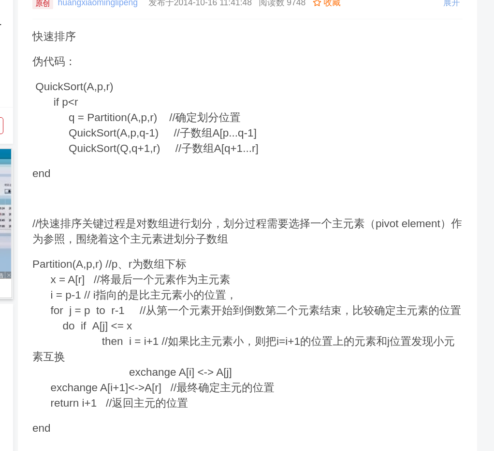

# All

## android

1. layout中不能有大写字母

4,5
2.2
3.1控制UI界面方式

3.2布局管理器
    * 布局特点 属性 默认值 表格布局和网格布局差异 相对布局的属性

3.3 文本框按钮 列表视图 单元框和复选框 判断是否选中

第五章,第六章 重中之重
activity 返回参数接受 startactivity 参数

177页 5.2 5.3（背
）
第六章
category配置
6.如何用intent拨打电话发送短信
7.事件的定义方式 屏蔽后退键 触摸事件
资源分别在那个文件夹下 颜色字符串使用资源
8.6 8.9
资源 用xml activity 如何使用资源

sqllite 主要类
文件存储 contentProvider Uri格式 登录记住用户名密码

第九章 编程题 绘图类 常用方法 矩形○的绘画 网上下载图片 bitmapFactory 添加特效 旋转缩放平移什么对象方法
9.4 动画

11 contentProvider 数据模型 p350 p355 自定义contentProvider 函数和概念
线程的开启中断处理 handler消息机制 发送接收处理哪些接口类 方法 分别什么作用

service 使用 生命周期 分两种 start bind 先后 生命周期方法 两个接口 ibander serviceconnet 401代码

网络编程 okhttp httpUrL connection httpClient了解 webView

广播常驻非常驻 分类 注册方式 常用 自定义广播 优先级别 Java xml 如何定义 全考

## javaEE

1. Hibernate 编程or简答 load get 区别

## 算法

1. 贪心算法和动态规划差异（简答）
2. 贪心
    * 活动安排问题
    * 最优装载问题
    * 哈弗曼编码
    * 单源最短路径
    * 最小生成树
    * 多机调度问题

3. 选择45，填空15，简答3×5， 算法题：四个算法题中的两个 10+15
4. 动态规划-填表或者算法
5. 时间复杂度，动态规划，分治法，贪心算法基本策略
6. 简答两个算法差异联系
7. 什么是算法，填空选择
8. 算法的特性 填空
9. 算法设计的质量指标
10. 简答算法和程序区别
11. 算法复杂性 时间复杂性 空间复杂性
12. 合并排序推导
13. 快速排序伪码
14. 动态规划概念
15. 单源最短路径选择题
16. 最小生成树
17. 活节点
18. 装载问题时间复杂度
19. N皇后时间复杂度
20. 分支限界法，回溯法区别

### 算法背记

1. 什么是算法:算法是求解某一特定问题的一组有穷规则的集合，它是由若干条指令组成的有穷符号串
2. 算法的五个重要特性
   1. 确定性
   2. 可实现性
   3. 输入
   4. 输出
   5. 有穷性

3. 算法设计的质量指标
   1. 正确性
   2. 可读性
   3. 健壮性
   4. 效率与存储量

4. 算法与程序的区别
   1. 程序：一个计算机程序是对一个算法使用某种程序设计语言的具体实现
   2. 任何一种程序设计语言都可以实现任何一个算法
   3. 算法的有穷性意味着不是所有的计算机程序都是算法

5. 算法复杂性=`算法所需要的计算机资源`=`时间复杂度`+`空间复杂性`
6. 一般考虑三种情况下的时间复杂性：`max`，`min`,`avg`

7. 合并排序
   1. 复杂度
      * T(n)=O(nlogn)

   2. 代码

        ```Java
        public class MergeSort {
        public static void main(String []args){
            int []arr = {9,8,7,6,5,4,3,2,1};
            sort(arr);
            System.out.println(Arrays.toString(arr));
        }
        public static void sort(int []arr){
            int []temp = new int[arr.length];//在排序前，先建好一个长度等于原数组长度的临时数组，避免递归中频繁开辟空间
            sort(arr,0,arr.length-1,temp);
        }
        private static void sort(int[] arr,int left,int right,int []temp){
            if(left<right){
                int mid = (left+right)/2;
                sort(arr,left,mid,temp);//左边归并排序，使得左子序列有序
                sort(arr,mid+1,right,temp);//右边归并排序，使得右子序列有序
                merge(arr,left,mid,right,temp);//将两个有序子数组合并操作
            }
        }
        private static void merge(int[] arr,int left,int mid,int right,int[] temp){
            int i = left;//左序列指针
            int j = mid+1;//右序列指针
            int t = 0;//临时数组指针
            while (i<=mid && j<=right){
                if(arr[i]<=arr[j]){
                    temp[t++] = arr[i++];
                }else {
                    temp[t++] = arr[j++];
                }
            }
            while(i<=mid){//将左边剩余元素填充进temp中
                temp[t++] = arr[i++];
            }
            while(j<=right){//将右序列剩余元素填充进temp中
                temp[t++] = arr[j++];
            }
            t = 0;
            //将temp中的元素全部拷贝到原数组中
            while(left <= right){
                arr[left++] = temp[t++];
            }
        }
        }
        ```

8. 快速排序
   1. 时间复杂度O(NlogN)
   2. 

9. 分治思想
   1. 分治法的设计思想是，将一个难以直接解决的大问题，分割成一些规模较小的相同问题，以便各个击破，分而治之
   2. 分解解决合并

10. 动态规划基本思想
    * 把求解的问题分成许多阶段或多个子问题，然后按顺序求解各个子问题。前一个子问题的解为后一个子问题的求解提供了有用的信息。在求解任何一子问题时，列出各种可能的局部解，通过决策保留那些有可能达到最优的局部解，丢弃其他局部解，依次解决各子问题，最后一个子问题就是问题的解

11. 贪心算法
    1. 贪心算法总是作出在当前看来最好的选择，即所作的选择只是局部最优选择。 希望从局部的最优选择得到整体最优解。采用逐步构造最优解的方法。在每个阶段，都作出一个看上去最优的决策（在一定的标准下）。决策一旦作出，就不可再更改。

12. 贪心算法和动态规划算法的差异
    1. 相同点：都具有最优子结构性质
    2. 区别：
       1. 动态规划算法每步所作的选择往往依赖于相关子问题的解。只有解出相关子问题才能作出选择。
       2. 贪心算法仅在当前状态下作出最好选择，即局部最优选择，但不依赖于子问题的解

    3. 贪心：`自顶向下`，动态规划：`自底向上`

13. 贪心解决背包问题

    ```c
    void Knapsack(int n, float M, float v[ ], float w[ ], float x[ ] )
    {
        Sort (n, v, w);//将各种物品按单位重量价值排序
        int i;
        for ( i = 1; i <= n; i++ ) x[i] = 0;//将解向量初始化为零
        float c = M; // 是背包剩余容量初始化为M
        for (i = 1;i <= n; i++ ) {
            if (w[i]>c) break;
            x[i] = 1;
            c-=w[i];
        }
        if ( i <= n ) x[i]=c/w[i];
    }
    ```

14. 分支限界法和回溯法的区别
    1. 求解目标：回溯法的求解目标是找出解空间树中满足约束条件的所有解，而分支限界法的求解目标则是找出满足约束条件的一个解，或是在满足约束条件的解中找出在某种意义下的最优解
    2. 搜索方式的不同：回溯法以深度优先的方式搜索解空间树，而分支限界法则以广度优先或以最小耗费优先的方式搜索解空间树

15. Ο(1) < Ο(logn) < Ο(n) < Ο(nlogn) < Ο(n2) < Ο(n3)

16. Ο(2n) < Ο(n！) < Ο(n^n)

17. 线性时间选择最坏O(n^2),平均O(n)
18. 动态规划算法两个基本要素
    1. 最优子结构性质
    2. 子问题重叠性质

19. 遍历子集树需要o(2^n)，排列树O(n!)
20. 装载问题复杂度，最坏O(n2^n),可以降低为O(2^n)
21. N皇后问题时间复杂度O(n^n)
22. 用约束条件剪去得不到可行解的子树；
23. 用限界函数剪去得不到最优解的子树