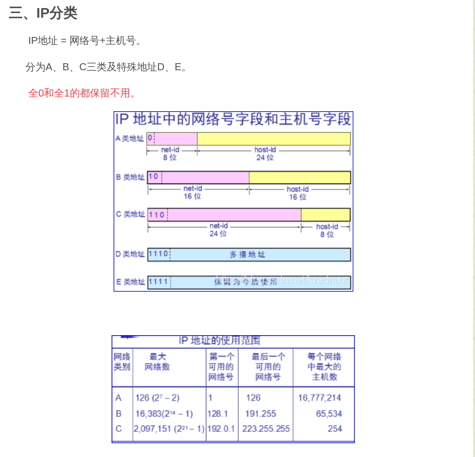

# 计算机网络复习

## 重点

1. 交换方式
   1. 分组交换：`存储转发技术`:单个分组传送到相邻节点，存储下来后查找转发表，转发到下一个节点
   2. 电路交换：建立连接$\Rightarrow$通话$\Rightarrow$释放连接，整个报文比特流连续地从原点直达终点，好像在一个管道中传送
   3. 报文交换：整个报文先传送到相邻节点，全部存储下来后查找转发表，转发到下一个节点

2. 广域网WAN，城域网MAN，局域网LAN，个人局域网PAN
3. 协议、协议三要素(`语法`，`语义`，`同步/时序`)
4. 体系结构（ISO  TCP/IP）
   1. OSI(七层，从下向上)
      1. 物理层
      2. 数据链路层
      3. 网络层
      4. 运输层
      5. 会话层
      6. 表示层
      7. 应用层

   2. TCP/IP
      1. 网络接口层
      2. 网际层IP
      3. 运输层(TCP/IP)
      4. 应用层

   3. 五层协议
       1. 物理层
       2. 数据链路层
       3. 网络层
       4. 运输层
       5. 应用层

5. 物理层网络SDH(同步数字系列)/SONET(同步光纤网)
   * 宽带接入网技术（ADSL/HFC/FTTx)
6. 复用技术(TDM/FDM/CDMA/WDM)
   1. TDM 时分复用
   2. FDM 频分复用
   3. WDM 波分复用
   4. CDMA 码分复用
7. TCP/UDP/ICMP/IP/ARP/应用层协议
   1. 地址解析协议ARP
   2. 网际控制报文协议ICMP，会送请求和回答，时间戳请求和回答
   3. 用户数据报协议UDP
   4. 传输控制协议TCP
   5. 差别
      1. udp无连接，面向报文，尽最大努力交付
      2. TCP全双工，可靠交付，面向字节流

8. TCP三大算法
   * 差错控制:超时重传，超时计时器，ARQ协议，回退N，累积确认
   * 流量控制：滑动窗口机制，rwnd接受窗口，ACK字段为1确认字段才有意义，持续计时器，探测报文段
   * 拥塞控制，cwnd拥塞窗口，慢开始门限ssthresh,

9. 网络工具Ping,netstat,tracert（ICMP的应用）
10. IP地址分类，子网划分，掩码（网络前缀），规模
11. 网络互联设备，不同层次
    * hub/repeater/
    * switcher L2/bridge
    * router/switch L3
    * geteway
12. 网络提供两种服务方式，各自的特点
    * 虚电路：在数据传输之前必须通过虚呼叫设置一条虚电路。它适用于两端之间长时间的数据交换。
      * 优点：可靠，保持顺序
      * 缺点：如有故障，则经过故障点的数据全部丢失
    * 数据报：在目的地需要重新组装报文
      * 优点：如有故障可绕过故障点。
      * 缺点：不能保证按顺序到达，丢失不能立即知晓
13. 以太网协议，争用期，帧，物理层规范（10base-T）
    * IEEE802.3  CSMA/CD
14. 路由协议RIP/OSPF/BGP4
    * 3W原则
    * RIP更新算法
15. IP层各个协议之间的关系
    * IP ARP RIP OSPF 怎么协调工作
    * ARP地址解析协议，根据IP地址获取物理地址，**ARP是解决同一个局域网上主机或路由器IP地址和硬件地址的映射问题**
    * RIP：路由信息协议，是一个内部网关协议，是一种基于距离矢量的路由协议，以路由跳数作为计数单位的路由协议，适合用于比较小型的网络环境。它选择路由的度量标准是跳数，最大跳数是15跳，如果大于15跳，它就会丢弃数据包。
    * OSPF：开放式最短路径优先，是一个内部网关协议，是对链路状态路由协议的一种实现，用Dijastra算法实现。它选择路由的度量标准是带宽，延迟。

16. 网络性能指标
    * 带宽/吞吐量/时延/
17. VLAN,VPN

18. 交换机自学习算法
    * 学习（发送方的地址）
    * 转发（接收方的地址）
19. RIP算法
    1. 基于距离向量的路由选择协议

20. IP转发算法

21. 确认号与序号的关系

22. 透明传输
    * 比特填充（同步）:CRC检验,
      1. 发送：5个连续1填入一个0
      2. 接收到：5个连续1删除一个0
    * 字节填充（异步）:ESC，PPP协议
      1. 出现7E,转为7D,5E
      2. 出现7D,转为7D,5D
      3. 出现小于20，如03，转为7D,23
23. 码分复用原理
    * 向量正交
24. 信道通信方式
    * 单工，半双工，全双工
25. 通信三要素
    * 信源，信宿，信道
26. 每层的地址
    * 物理地址/MAC地址
    * IP地址
    * 端口
    * 域名/URL
27. 冲突域与广播域的关系
    1. 冲突域就是连接在同一导线上的所有工作站的集合，或者说是同一物理网段上所有节点的集合，或以太网上竞争同一带宽的节点集合
    2. 广播是一种信息的传播方式，指网络中的某一设备同时向网络中所有的其它设备发送数据，这个数据所能广播到的范围即为广播域(Broadcast Domain)。即，网络中能接收任一设备发出的广播帧的所有设备的集合
    3. 广播域与冲突域的区别
       1. 广播域可以跨网段，而冲突域只是发生的同一个网段的。
       2. 冲突域：在同一个冲突域中的每一个节点都能收到所有被发送的帧;基于物理层
       3. 广播域：网络中能接收任一设备发出的广播帧的所有设备的集合;基于数据链路层
       4. 一个局域网就是一个广播域（往往是指一个IP段内），广播域中的机器可以收到域中其他任何一台机器的广播，而不能收到域外机器的广播，域外机器也不能收到域内机器发的广播
       5. 冲突域：一个站点向另一个站点发出信号。能收到信号的站点就构成一个冲突域

28. 三次握手过程

29. 拥塞控制过程
    * 慢开始/拥塞避免/
    * 超时
    * 三个重复确认  快恢复
30. 应用层的协议
    * DNS
      * 域名服务器
      * 以区为单位，区是域的子集
      * 根域名服务器采用`任播`
      * 主机向本地查询：递归
      * 本地向根查询：迭代
    * FTP
      * 熟知端口21
      * 主进程：接受新的请求
      * 控制进程，数据传送进程
    * HTTP
      * 面向事物
      * 无状态
      * 无连接
    * SMTP简单邮件传输协议，发送
    * 邮局协议POP3，读取
    * DHCP动态主机配置协议，即插即用联网

31. 交换结构
    1. 通过存储器
    2. 通过总线
    3. 通过互联网络

## 背记

1. 答： （1）电路交换：端对端通信质量因约定了通信资源获得可靠保障，对连续传送大量数据效率高。（2）报文交换：无须预约传输带宽，动态逐段利用传输带宽对突发式数据通信效率高，通信迅速。（3）分组交换：具有报文交换之高效、迅速的要点，且各分组小，路由灵活，网络生存性能好

2. 答：（1） internet（互联网或互连网）：通用名词，它泛指由多个计算机网络互连而成的网络。；协议无特指（2）Internet（因特网）：专用名词，特指采用 TCP/IP 协议的互联网络。区别：后者实际上是前者的双向应用

3. 1-22 网络协议的三个要素是什么？各有什么含义？
    1. 网络协议：为进行网络中的数据交换而建立的规则、标准或约定。由以下三个要素组成
    2. 语法：即数据与控制信息的结构或格式
    3. 语义：即需要发出何种控制信息，完成何种动作以及做出何种响应
    4. 同步：即事件实现顺序的详细说明

4. 2-06 数据在信道重的传输速率受哪些因素的限制？信噪比能否任意提高？香农公式在数据通信中的意义是什么？“比特/每秒”和“码元/每秒”有何区别？
答：码元传输速率受奈氏准则的限制，信息传输速率受香农公式的限制 ，香农公式在数据通信中的意义是：只要信息传输速率低于信道的极限传信率，就可实现无差传输。比特/s是信息传输速率的单位码元传输速率也称为调制速率、波形速率或符号速率。一个码元不一定对应于一个比特

5. 2-13 为什么要使用信道复用技术？常用的信道复用技术有哪些？
答：为了通过共享信道、最大限度提高信道利用率。频分、时分、码分、波分

6. 2-17 试比较xDSL、HFC以及FTTx接入技术的优缺点？
答：xDSL 技术就是用数字技术对现有的模拟电话用户线进行改造，使它能够承载宽带业务。成本低，易实现，但带宽和质量差异性大。HFC网的最大的优点具有很宽的频带，并且能够利用已经有相当大的覆盖面的有线电视网。要将现有的450 MHz 单向传输的有线电视网络改造为 750 MHz 双向传输的 HFC 网需要相当的资金和时间。FTTx(多种宽带光纤接入方式)（光纤到……）这里字母 x 可代表不同意思。可提供最好的带宽和质量、但现阶段线路和工程成本太大

7. 以太网发送都是`曼彻斯特编码`

8. 电磁波在1km电缆的传播时延约为`5us`

9. 网络层向上至提供简单灵活的，无连接的,尽量大努力交付的数据报服务

10. 网络层：IP协议(ARP,ICMP,IGMP),运输层：TCP,UDP

11. 中间设备
    1. 物理层：转发器
    2. 数据链路层：网桥，桥接器
    3. 网络层：路由器
    4. 网络层以上：网关

12. 互联网是由多种`异构`网络构成

13. ip地址的编制方法共经过了三个历史阶段
    1. 分类的ip地址
    2. 子网的划分
    3. 构成超网

14. 一个网络号在真个互联网范围内必须是`唯一的`
15. 一台主机号在它前面的网络号所指明的网络范围必须是`唯一的`

16. ip地址划分

17. ABC类地址：`单播`，DE:`多播`

18. A类网络号占用一个字节，只有7位可用，可以指派126($2^7-2$)个网络号
    1. 全0为保留地址，意思本网络
    2. 01111111(7个1)环回测试，127的地址根本不是一个网络地址

19. 每一个A类网络最大主机数是$2^{24}-2$
    1. 全0的主机字段表示该IP地址是“本主机”所连接到的单个网络地址
    2. 全1主机字段表示该网络上的所有主机

20. B类前两位(10)固定，不存在网络号全0全1,128.0.0.0不指派，可指派$2^{14}-1$个网络地址，最小网络地址 128.1.0.0

21. C类可指派$2^{21}-1$网络数

22. 物理地址是数据链路层和物理层使用的地址 ，而IP地址 是网络层和以上各层使用的地址，是一种逻辑地址

23. IP地址放在IP数据报的首部，而硬件地址则放在MAC帧的首部

24. IP数据报`32位`即4字节

25. 标识，片偏移，标志(flag):MF=1还有分片，MF=0最后一个，DF=0允许分片

26. //24表示前24为是网络号
27. 若确认号=N，则表明，到序号N-1为止的所有数据都已经正确收到，

28. 私网地址是：
    1. A类地址：10.0.0.0～10.255.255.255
    2. B类地址：172.16.0.0 ～172.31.255.255
    3. C类地址：192.168.0.0～192.168.255.255
