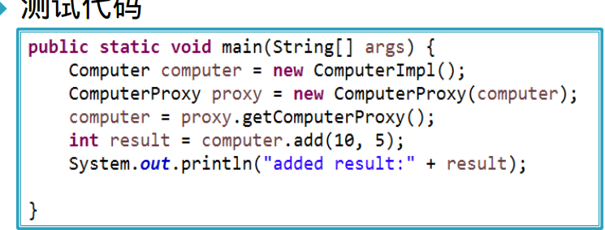

# javaEE复习

## 可能的简答

1. IOC最大好处，实现方式
   1. 解决了传统软件开发中组件耦合性高，维护困难的问题，更改组件依赖关系可以通过修改相关的xml配置文件或注解实现，而无需修改代码
   2. 接口注入，设值注入，构造器注入

2. MVC3个组成部分各自任务
   1. 模型层实现系统中的业务逻辑
   2. 视图层则用于与用户的交互，通常用JSP来实现
   3. 控制层则是模型层和视图层之间沟通的桥梁，它可以把用户的请求分派并选择恰当的视图来显示它 们，同时它也可以解释用户的输入并将其映射为模型层能够执行的操作。

3. 对象关系映射是一种数据持久化技术，其思想是把对象模型与关系数据库的表建立映射关系，开发人员可以把对数据库的操作转化为对JavaBean对象的操作，从而不需要在使用SQL语句操作数据库中的表，代之以直接操作JavaBean对象，就可以实现数据的存储，查询，更改和删除等操作
4. (Hibernate)load和get区别：都是持久化对象方法
   1. 使用load()方法，如果没有找到记录，就会抛出异常
   2. 使用get()方法，如果没有找到记录，返回null

## 第二至五章

1. http默认端口：`80`
2. HTTP特点：
   1. 简单快速
   2. 灵活
   3. 无连接
   4. 无状态

3. http请求
   1. 请求行
   2. 消息报头
   3. 请求正文

4. 请求方法
   1. GET：请求获取Request-URI所标识的资源
   2. POST：在Request-URI所标识的资源后附加新的数据
   3. HEAD：请求获取由Request-URI所标识的资源的响应消息报头
   4. PUT：请求服务器存储一个资源，并用Request-URI作为其标识
   5. DELETE：请求服务器删除Request-URI所标识的资源
   6. TRACE：请求服务器回送收到的请求信息，主要用于测试或诊断
   7. CONNECT：保留将来使用
   8. OPTIONS：请求查询服务器的性能，或者查询与资源相关的选项和需求

5. 状态代码
   1. 1xx:提示已接收
   2. 2xx:成功
   3. 3xx:重定向
   4. 4xx：客户端错误
   5. 5xx:服务端错误

6. XMLhttpRequest的常用方法和属性 66页
   1. open
   2. send
   3. onreadystatechange
   4. readyState
   5. status

7. Servlet容器
   1. 如果装在并创建了servlet实例化对象则用`service`方法将创建的请求和相应对象作为参数传递进去
   2. 若没有则用`init`创建
   3. 卸载用`destroy`

8. Servlet生命周期
   1. 加载和实例化，第一次访问创建或启动创建\<load-on-startup>
   2. 初始化：用init，目的是如建立数据库连接，获取配置信息，异常ServletException
   3. 请求处理:用service处理，ServletRequest，ServletResponse
   4. 服务终止：`destroy`
   5. init,destroy都只执行一次

9. Servlet接口(p75)
   1. init()
   2. getServletConfig()
   3. Service()
   4. destroy()

10. web.xml配置
    1. \<servlet>
       1. \<servlet-name>:指定名称
       2. \<servlet-class>：指定路劲

    2. \<servlet-mapping>:映射一个已注册的Servlet的对外访问路径
       1. \<servlet-name>：指定访问路径的Servlet名称
       2. \<url-pattern>:用于指定Servlet访问路径

    3. 注解`@WebServlet("\\RegisterServlet")`

11. 判断转发重定向
    1. \<a href="index.jsp">,客户端，重定向
    2. errorPage,服务端，转发
    3. getDispather.forward,服务端 转发
    4. setHeader 客户端
    5. sendRedirect("url") 客户端 重定向
    6. \<jsp:forward> 服务端 转发

12. Tomcat
    1. bin:启动Tomcat命令
    2. conf:配置文件
    3. work：jsp转为servlet
    4. server.xml：配置文件定义端口，web应用目录

13. Tomcat默认端口`8080`

14. 编写第一个Servlet

    ```HTML
    <form id="login" method="post" action="/ServletDemo/Servlet/LoginServlet">
        用户名：<input type="text" name="username" width="50"/><br>
        密码:<input type="password" name="pass" width="50"/><br>
        <input type="submit" value="登录"/><br>
    </form>
    ```

    ```java
    protected void doPost(HttpServletRequest request,HttpServletResponse response)throws ServletException,IOException{
        request.setCharacterEncoding("utf-8");
        String username=request.getParameter("username");
        String password=request.getParameter("pass");
        response.setContentType("text/html;charset=utf-8");
        PrintWriter out=response.getWriter();
        out.println("<html><head><title>登录结果<title><head>");
        out.println("<body>您输入的用户名是："+username+"<br>");
        out.close();
    }
    ```

    ```xml
    <servlet>
        <servlet-name>loginServlet</servlet-name>
        <servlet-class>edu.hdu.web.LoginServlet</servlet-class>
    </servlet>
    <servlet-mapping>
        <servlet-name>loginServlet</servlet-name>
        <url-pattern>/Servlet/LoginServlet</url-pattern>
    </servlet-mapping>
    ```

15. web.xml配置HTML字符编码

    ```xml
    <servlet>
        <init-param>
            <param-name>encoding</param-name>
            <param-value>GBK</param-value>
        </init-param>
    </servlet>
    ```

    ```java
    ServletConfig config=this.getServletConfig();
    String encoding=config.getInitParameter("encoding");
    response.setContentType("text/html;charSet="+encoding);
    ```

16. 过滤器
    1. filter是针对url的
    2. 注解：`@WebFilter(filterName="encodingFilter",urlPatterns="/*")`
    3. 放行请求：`chain.doFilter(,request,response);`

17. 过滤器生命周期
    1. 初始化：`init()`
    2. 过滤：`doFilter()`
    3. 销毁：`destory()`

18. doFilter()示例

    ```java
    public void doFilter(ServletRequest request, ServletResponse response, FilterChain chain) throws IOException, ServletException {
        String encoding =config.getInitParameter("encoding");

        request.setCharacterEncoding(encoding);
        HttpServletRequest requ=(HttpServletRequest)request;
        HttpSession session=requ.getSession(true);

        //获取客户请求页面
        String requestPath=requ.getServletPath();
        //如果Session范围的user为null，即表明没有登录
        //且用户请求的不是登录页面
        //且用户请的既不是登录页面，也不是处理登录的Servlet页面
        if(session.getAttribute("user")==null&&!reqestPath.endsWith("login.jsp"
        )&&!requestPath.endsWith("LoginServlet")){
            ((HttpServletResponse)response).sendRedirect("login.jsp");
            return;
        }else(
            //放行请求
            chain.doFilter(,request,response);
        )
    }
    ```

19. 配置Filter

    ```xml
    <filter>
        <filter-name>log</filter-name>
        <!-- filter的实现类 -->
        <filter-class>edu.hdu.web.LogFilter</filter-class>
        <init-param>
            <param-name>encoding<param-name>
            <param-value>GBK<param-value>
        <init-param>
    </filter>
    <!-- 定义filter的拦截地址 -->
    <filter-mapping>
        <filter-name>log<filter-name>
        <!-- filter负责拦截的URL -->
        <url-pattern>/*<url-pattern>
    <filter-mapping>

    ```

## 第六章JSP&&JSTL&&EL

1. JSP工作原理：本质Servlet，当jsp第一次被请求时，web服务器上的jsp容器将其转为相应的servlet文件，再便以为相应的servlet类文件，并且被装载和实例化，本次以及以后对此jsp的请求都将通过调用已经实例化的Servlet对象中的方法来产生响应
2. jsp执行过程：翻译，编译，执行

3. jsp生命周期

4. jsp注释
   1. `<%//单行注释%>`注释单行
   2. `<%/*多行注释 */%>`注释多行
   3. `<!--comment<%=expression%>-->`,客户端注释
   4. `<%--注释--%>`隐式注释，服务器端

5. `page`指令`<%@page %>`
   1. import="java.io.*"
   2. errorPage="url"
   3. isErrorPage="true|false"
   4. language="java"
   5. session="true|false"

6. include指令

7. `taglib`指令：用于提供类似xml中自定义新标记的功能，其基本语法如下:
   * <%@ taglib url="relative taglibURL" prefix="taglibPrefix" %>

8. JSP异常
   1. JspError:转换期错误
   2. JspException：请求期异常，errorpage，iserrorpage

9. JSP内置对象
   1. `request`:getParameter(String name),setCharacterEncoding(String encoding)
   2. `response`:sendRedirect(string location), get/setBufferSize
   3. `out`:print()
   4. `session`:getAttribute(String name)
   5. `pageContext`
   6. `application`:
10. 属性保存范围
    1. page：只在一个页面中保存属性、跳转之后无效
    2. request：在一次请求中保存属性，服务器跳转之后依旧有效
    3. session：在一次会话返回中有效，无论何种跳转都可以使用，但是新开的浏览器无法使用
    4. application：在整个服务器上保存，所有用户都可以使用

11. EL
    1. `${表达式}`
    2. 查找范围：pageScope，requestScope，sessionScope，applicationScope
    3. map:{$map1.a},map1:${map1["a"]}
    4. empty判断是否为null或空${empty param.name}

12. jstl
    1. 用于简化jsp当中java代码的书写，与el表达式可以结合使用
    2. `<c:if test="${number%2!=0}">`

        ```xml
        <c:choose>
            <c:when test="${number==1}">星期一</c:when>
            <c:when test="${number==2}">星期二</c:when>
            <c:when test="${number==3}">星期三</c:when>
            <c:when test="${number==4}">星期四</c:when>

            <c:otherwise>数字输入有误</c:otherwise>
        </c:choose>

        ```

        ```xml
        <c:forEach begin="1" end="10" var="i" step="1" varStatus="s">
            ${i}<h3>${s.index}</h3><h4>${s.count}</h4><br>
        </c:forEach>

        <%
            List list=new ArrayList();
            list.add("aaa");
            list.add("bbb");
            list.add("ccc");

            request.setAttribute("list",list);
        %>

        <c:forEach items="${list}" var="str" varStatus="s">
            ${s.index}${s.count}${str}<br>
        </c:forEach>

        ```

## Struts

1. MVC;mvc思想是将系统的各个组件进行分类，不同的组件扮演不同的角色。然后将系统中的组件分隔到不同的层中，这些组件将被限制在其所在层内。同层中的组件应该保持起内聚性，且大致处于同一抽象级别，而各层之间则以松散耦合的方式组合在一起，从而促进了良好的封装性
2. MVC将一个应用的输入、处理和输出流程按照Model、View和Controller三部分进行分离，这样一个应用可以划分成模型层、视图层和控制层。三层之间以最少的耦合来协同工作从而提高了应用系统的可扩展性和可维护性

3. Struts的核心是过滤器（`FilterDisptcher`）

4. org.apache.struts2.dispatcher.filter.StrutsPrepareAndExecuteFilter

5. web.xml配置
   1. 错误页：error-page
   2. session-config

    ```xml
    <web-app xmlns:xsi="http://www.w3.org/2001/XMLSchema-instance" xmlns="http://java.sun.com/xml/ns/javaee" xsi:schemaLocation="http://java.sun.com/xml/ns/javaee http://java.sun.com/xml/ns/javaee/web-app_3_0.xsd" id="WebApp_ID" version="3.0">
    <display-name>nl1120</display-name>
    <welcome-file-list>
        <welcome-file>index.jsp</welcome-file>
    </welcome-file-list>
    <filter>
        <filter-name>struts</filter-name>
        <filter-class>org.apache.struts2.dispatcher.filter.StrutsPrepareAndExecuteFilter</filter-class>
    </filter>
    <filter-mapping>
        <!--/*.action时，所有请求action的路径后面必须加上.action后缀  -->
        <filter-name>struts</filter-name>
        <url-pattern>/*</url-pattern>
    </filter-mapping>
    </web-app>
    ```

6. struts.xml配置
   1. result
      1. name
      2. type:默认为`dispatcher`,链接两个Action`chain`，重定向到另一个资源`redirect`,重定向到另一个Action`redirectAction`

    ```xml
    <struts>
        <!-- 开启struts的开发模式，name值可以在default.properties文件中查找 -->
        <constant name="struts.devMode" value="true"></constant>
        <!-- action的访问路径是其package的访问路径 + action的name
        package的namespace=”/“  action的name=test   访问路径： ~pj虚拟目录/test
        package的namespace=”/ax“  action的name=test  访问路径:~pj虚拟目录/ax/test
            从action到success.jsp默认的跳转方式：转发（服务器端进行）
        -->
        <package name="base" namespace="/ax" extends="struts-default">
        <!--  action的name不需要加上action后缀
            class指定用于处理此url的Action，全类名
            method:配置该请求的处理方法，默认为execute（不配置时默认选项）
        -->
            <action name="test"  class="nl1120.TestAction" method="execute">
                <result name="success">/success.jsp</result>
                <result name="usersuccess">/userSuccess.jsp</result>
            </action>
        </package>
    </struts>
    ```

7. action的编写
   1. 如何编写
      1. 实现Action接口
      2. 继承ActionSupport类
   2. resultcode
      1. NONE：表示当action正确执行完成后，并不转向到任一的视图
      2. ERROR：表示当action执行失败后，转向到错误处理视图
      3. INPUT：表示执行当前action时，对输入数据的视图传递过来的参数进行校验，而校验没有通过，将转向回输入数据的视图
      4. LOGIN：表示执行当前逻辑需要用户登录，而用户没有登录，所以转向到登录视图

   3. 使用`method`属性
   4. ActionContext获取request，session，application

## Spring

1. Spring是一个bean的容器，spring用于管理bean,管理对象的生命周期、对象的组态、相依注入等，并可以控制对象的创建方式。

2. 控制反转/依赖注入：对象的依赖关系是由容器来控制的，程序只负责接口的控制，控制权从代码到外部容器的转移

3. 控制反转三种形式
   1. 接口注入
   2. 设值注入：直观明显
   3. 构造器注入：设置注入顺序，符合高内聚

        ```xml

        <constructor-arg  index="0" value="波斯猫"></constructor-arg>
        <constructor-arg  value="5" type="int"></constructor-arg>
        ```

4. Bean配置
   1. bean实例化方式：反射
   2. ApplicationContext context = new ClassPathXmlApplicationContext("ApplicationContext.xml")
   3. 属性
      1. scope：表示Bean的默认作用域为`Singleton`,单实例模式
      2. init-method：初始化方法
      3. destroy-method:销毁方法
      4. autowire：自动装配
   4. 依赖注入
      1. 属性注入
         1. 引入其他Bean

            ```xml
            <bean id="department" class="com.spring4.model.Department"></bean>
            <bean id="employee" class="com.spring4.model.Employee">
                <property name="department" ref="department"></property>
            </bean>

            ```

      2. 构造器注入
      3. 工厂方法注入
   5. 自动装配
      1. `no`:默认不自动装配
      2. `byName`：根据属性名自动装配。Spring 自动查找与属性名相同的id，如果找到，则自动注入，否则什么都不做。必须将目标bean的名称和属性名设置完全相同
      3. `byType`：根据属性的类型自动装配。Spring 自动查找与属性类型相同的Bean，如果刚好找到唯一的那个，则自动注入；如果找到多个与属性类型相同的Bean，则抛出异常；如果没找到，就什么也不做。
      4. `constructor`

        ```xml
        <bean id="person" class="com.day3.Person" p:name="黄萧峰" p:age="20" autowire ="byName"></bean>

        ```

   6. Bean之间的关系：`继承`，`依赖`

5. IOC容器中Bean的生命周期
   1. 通过构造器或工厂方法创建bean的实例
   2. 为bean的属性设置值和对其他bean的引用
   3. 调用bean的初始化方法
   4. Bean初始化完，可以使用
   5. 当容器关闭时，调用bean的销毁方法

6. 特定组件
   1. `@Component`：基本注解，标志一个受Spring管理的组件
   2. `@Repository`：标志持久层组件
   3. `@Service`：标致服务层（业务层）组件
   4. `@Controller`：标志表示层组件

7. 在classpath扫面组件

    ```xml
        <!-- base-package:标记需要扫描的package
        它下面的子package也会被扫描到
        include-filter子元素,用来配置当前base-package下面那些符合规则的类或接口需要实例化 。
                                    需要将component-san的默认属性use-default-filters值改成false。
        exclude-filter子元素：排除掉符合规则的类或接口
    -->
    <!--
    <context:component-scan base-package="nl1204" use-default-filters="false">
    
        <context:include-filter type="annotation" expression="org.springframework.stereotype.Controller"/>
        <context:include-filter type="annotation" expression="org.springframework.stereotype.Service"/>
    </context:component-scan>
        -->
        <context:component-scan base-package="nl1204" ></context:component-scan>

        <aop:aspectj-autoproxy />
    ```

8. AOP：面向切面编程
   1. 切面(Aspect)
   2. 连接点(Joint Point)
   3. 通知(Advice)
   4. 切入点(Pointcut)
   5. 引入(Introduction)
   6. 目标对象(Target Object)
   7. AOP代理

9. 通知(Advice)
   1. 环绕通知
   2. 前置通知
   3. 抛出异常后通知
   4. 后置通知

10. 通知注解
    1. @Before("execution(* nl1204.comm..*.*(..))")
    2. @After("execution(* nl1204.comm..*.*(..))")
    3. @AfterReturning(value="execution(* nl1204.comm..*.*(..))",returning="result")
    4. @AfterThrowing("execution(* nl1204.comm..*.*(..))")
    5. Around,ProceedingJoinPoint

11. JDK动态代理
12. Aspectj

## Hibernate

1. 持久化：将内存中的数据保存到磁盘等存储设备中
2. 持久化对象:
   1. 指已经存储到数据库或磁盘中的业务对象
   2. 可以再创建它的程序的作用域之外保持其自身的状态

3. 对象关系映射是一种数据持久化技术，其思想是把对象模型与关系数据库的表建立映射关系，开发人员可以把对数据库的操作转化为对JavaBean对象的操作，从而不需要在使用SQL语句操作数据库中的表，代之以直接操作JavaBean对象，就可以实现数据的存储，查询，更改和删除等操作
4. 核心接口
   1. Session
   2. SessionFactory
   3. Configuration
   4. Transaction
   5. Query/Criteria

5. 示例代码

    ```Java

    try{
        //创建SessionFactory实例
        SessionFactory sf=new Configuration().configure().buildSessionFactory();
        //创建Session实例
        Session session=sf.openSession
        Transaction tx=session.beginTransaction();
        Book book = new Book();
        book.setIsbn("12180001");
        book.setName("结束19年");
        book.setAuthor("无名氏");
        //保存到数据库中
        session.save(book);
        tx.commit()
        session.close();
    }

    ```

6. Session
   1. Session 是应用程序与数据库之间交互操作的一个单线程对象，是 Hibernate 运作的中心，所有持久化对象必须在 session 的管理下才可以进行持久化操作
   2. Session相当于 JDBC 中的 Connection。 Session对象有一个一级缓存，显式执行 flush 之前，所有的持久层操作的数据都缓存在 session 对象处
   3. 取得持久化对象的方法： get() load()
   4. 持久化对象都得保存，更新和删除：save(),update(),saveOrUpdate(),delete()
   5. 开启事务: beginTransaction().
   6. 管理 Session 的方法：isOpen(),flush(), clear(), evict(), close()等

7. SessionFactory
   1. Configuration对象根据当前的配置信息生成 SessionFactory 对象。
   2. SessionFactory对象中缓存了当前的数据库配置信息和所有映射关系以及预定义的SQL语句。
   3. SessionFactory还负责维护Hibernate的二级缓存
   4. SessionFactory对象在应用初始化时被创建，是一个重量级的类，构造时很消耗资源。通常情况下，整个应用只有唯一的一个SessionFactory对象
   5. 使用Hibernate访问多个数据库，需要对每一个数据库使用一个SessionFactory对象
   6. 应用程序从SessionFactory对象中获得Session(会话)实例


8. Tansaction
   1. Transaction从底层的事务实现中抽象出来的接口
   2. 可能是一个JDBC事务或一个JTA事务，这有助于保持Hibernate应用在不同类型的执行环境或容器中的可移植性
   3. 使用Hibernate进行操作时必须显示的调用Transaction:Transaction tx =session.beginTransaction();
   4. 常用方法:
      1. commit():提交相关联的session实例
      2. rollback():撤销事务操作
      3. wasCommitted():检查事务是否提交

9. Query接口
   1. 使用Query类型的对象可以方便我们对数据库数据进行查询，它使用QBC、QBE、HQL或者原生SQL（Native SQL）对数据执行查询操作
   2. 代码

        ```java
        Configuration config = new Configuration().configure();
        SessionFactory sessionFactory = config.buildSessionFactory();
        Session session = sessionFactory.openSession();
        Transaction tx = session.beginTransaction();
        Query query = session.createQuery("from Guestbook");
        List list = query.list();
        tx.commit();

        ```

10. Criteria
    1. Criteria接口与Query接口非常类似，它允许我们创建并执行面向对象方式的查询
    2. 代码

        ```java
        Configuration config = new Configuration().configure();
        SessionFactory sessionFactory = config.buildSessionFactory();
        Session session = sessionFactory.openSession();
        Transaction tx = session.beginTransaction();
        Criteria crit = session.createCriteria(Guestbook.class);
        Criterion criterion1 = Restrictions.like("name", "刘%");
        crit.add(criterion1);
        List list = crit.list();
        tx.commit();
        ```

11. 对象状态
    1.`瞬时`(transient)：数据库中没有数据与之对应，超过作用域会被JVM垃圾回收器回收，一般是new出来且与session没有关联的对象。
    2. `持久`(persistent)：数据库中有数据与之对应，当前与session有关联，并且相关联的session没有关闭，事务没有提交；持久对象状态发生改变，在事务提交时会影响到数据库(hibernate能检测到)。
    3. `脱管`(detached)：数据库中有数据与之对应，但当前没有session与之关联；托管对象状态发生改变，hibernate不能检测到。

12. generator
    1. Increment：自动增长
    2. Identity：由底层数据库生成标识符
    3. native：适用于代理主键。根据底层数据库对自动生成表示符的能力来选择identity、sequence、hilo
    4. assigned:(默认)适用于自然主键。由java程序负责生成标识符。不能把setID()方法声明为Private的。尽量避免使用自然主键。

13. 映射复合主键

    ```xml
    <composite-id>
        <key-property name="first-name" column="firstname" type="string">
        <key-property name="last-name" column="lastname" type="string">
    </composite-id>

    ```

14. 关联关系映射
    1. 单向关联
       1. 一对多
          1. \<set> 元素来映射持久化类的set类型的属性
             1. name:设定待映射持久化类的属性名。\
             2. order-by: 当 Hibernate 通过 select 语句到数据库中检索集合对象时, 利用 order by 子句进行排序
             3. key子属性:设定与所关联的持久化类对应的表的外键,column: 指定关联表的外键名
             4. one-to-many子属性:设定所关联的持久化类(集合中存放的对象),class: 指定关联的持久化类的类名

       2. 一对一
       3. 多对多
       4. 多对一：\<many-to-one>
          1. `name`：指定关联属性的属性名，该属性是必须的
          2. `column`:指定关联的外键列列名，默认与关联属性同名
          3. `update`，insert：用于指定对应的字段是否包含在用于UPDATE、INSERT的语句中
          4. 代码示意:

    2. 多向关联
       1. 一对一
       2. 一对多
       3. 多对多

15. HQL语法(见书p167)