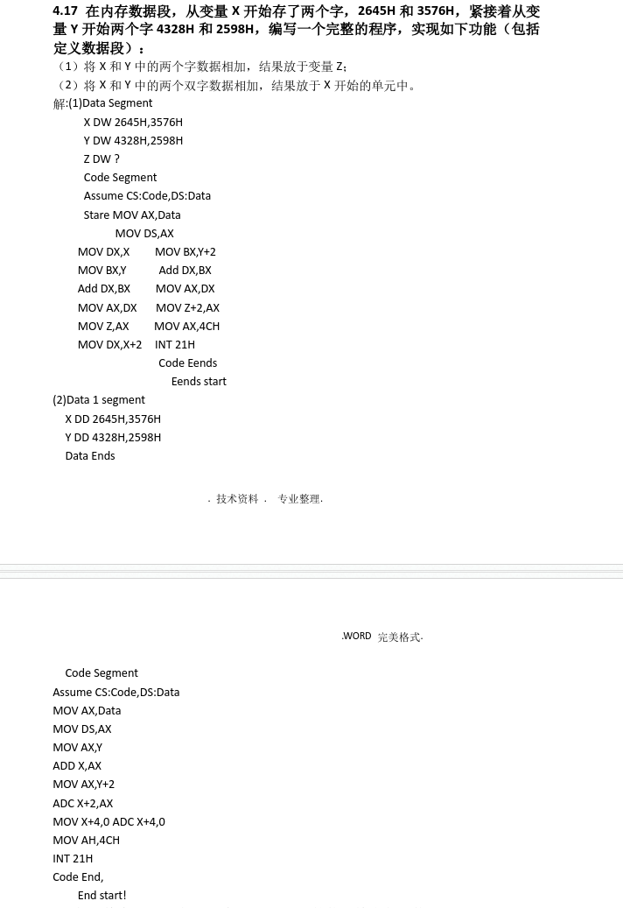
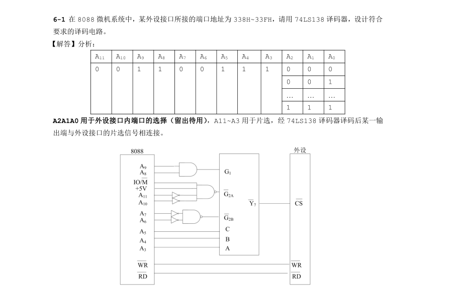
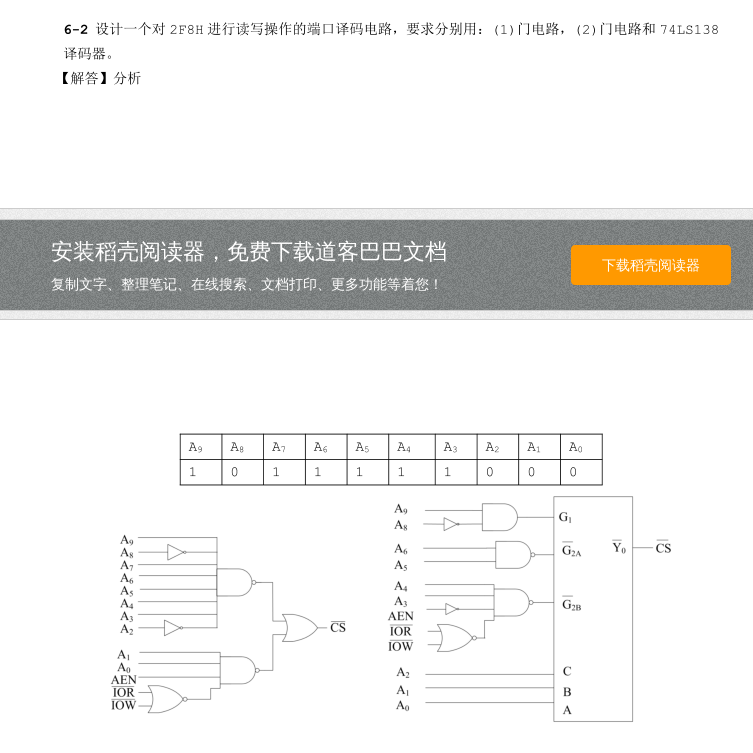
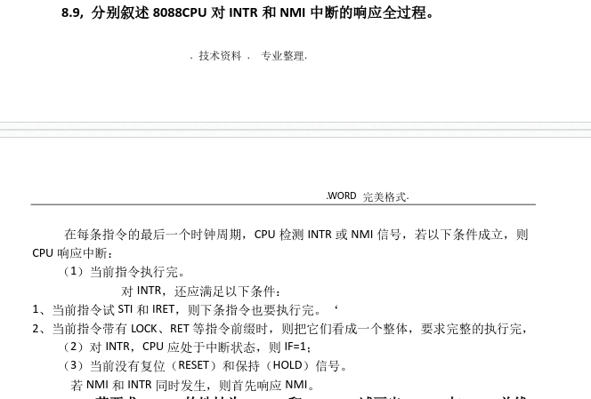
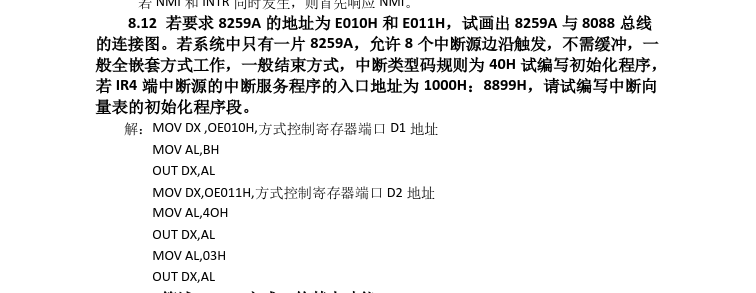
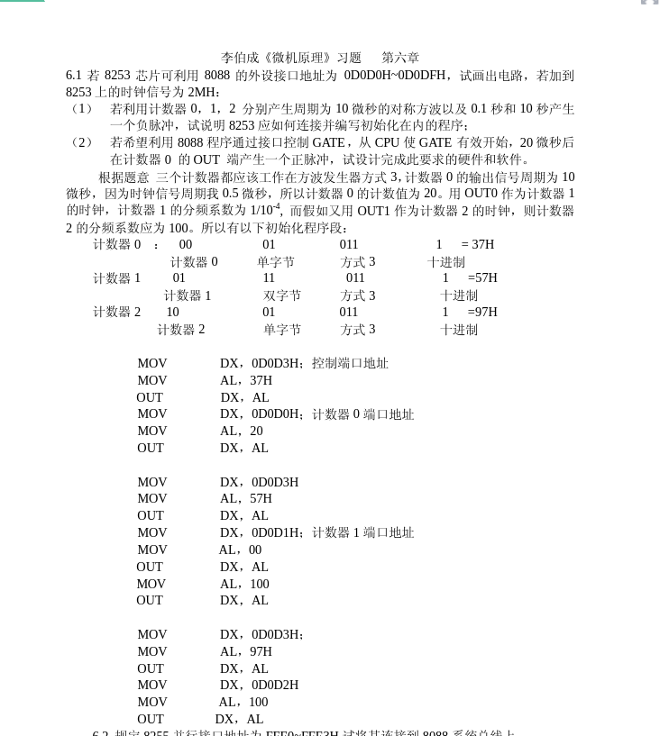
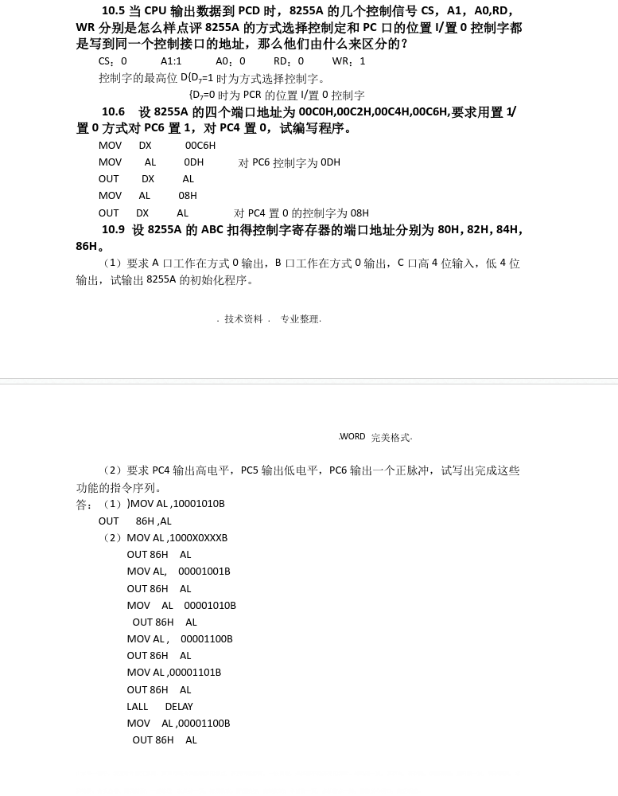

# 微机接口与原理

## 概念

1. 段寄存器
   1. 代码段寄存器`CS`
   2. 数据段寄存器`DS`
   3. 堆栈寄存器`SS`
   4. 附加段寄存器`ES`

2. 冯诺依曼计算机：
   1. 输入设备
   2. 输出设备
   3. 存储器
   4. 运算器
   5. 控制器

3. ALU进行逻辑和算术运算，累加器用来传输，临时存储ALU运算过程的结果和其他数据并能吧其中数据左移或者右移，累加器不是加法器

4. 程序计数器作用：用于存放指令的地址，程序执行，PC的初值为程序第一条指令的地址，在顺序执行程序时，控制器首先按程序计数器所指出指令地址从内存中去除一条指令执行，同时程序计数器+1指向下一条要执行的指令
5. 8088地址线数据线复用问题，ALE何时处于有效状态
   1. 采用分时复用方式，在总线周期的T1,ALE信号有效，传送地址信号，在总线周期T1周期后ALE失效，传送数据信号

6. 说明以下部件作用
   1. 8284时钟产生器：提供处理器和总线控制器的定时操作
   2. 74ls245：总线驱动器总线信号进行放大，还原并控制传输方向
   3. 74ls373:8位三态输出锁存器
   4. 该电路中能否不用锁存器：
      1. 不能，数据线和地址线 采用分时复用；，首先由CPU发出存储地址同时发出允许锁存信号ALE给锁存器，当锁存器接收到信号后将地址/数据总线上的地址锁存在总线上随后才能传输数据

7. 周期
   1. 指令周期：由数个机器周期组成一个指令周期
   2. 机器周期：完成一个基本操作所需时间
   3. T周期：计算器在时钟脉冲作用下，一个节拍一个节拍的工作，CPU处理动作最小单位
   4. 总线周期：机器周期中，CPU和存储器或IO端口传输一次数据所用时间

8. 通用寄存器
   1. 累加器：`AX`
   2. 基地址寄存器：`BX`
   3. 计数器：`CX`
   4. 数据寄存器：`DX`

9. 地址指针和变址寄存器组
   5. 堆栈指示器：`SP`
   6. 基地址指示器：`BP`
   7. 源地址寄存器：`SI`
   8. 目标地址寄存器：`DI`

10. 如果有效地址中含有BP，则其缺省的段寄存器为SS；否则，其缺省的段寄存器为DS。
11. BX,BP,DI,SI

12. 物理地址=段基址x16+段内偏移地址

13. I/O端口编址两种方式：独立编址与统一编址。
    1. I/O寄存器地址空间和存储器地址空间分开编址，但需一套专门的读写I/O的指令和控制信号。
    2. I/O寄存器与数据存储器单元同等对待，统一编址。不需要专门的I/O指令，直接使用访问数据存储器的指令进行I/O操作，简单、方便且功能强。

14. X1 EQU 1000H和X2=1000H区别
    * EQU伪指令中的表达式名是不允许重复定义的，而`=`可以重复定义

15. 何谓静态RAM？何谓动态RAM？它们的使用特点各是什么
    1. 静态RAM：简称SRAM，分为双极型静态RAM和CMOS型静态RAM，前者速度高于后者，但功耗大于后者，都以双稳态电路为基础，状态稳定，只要不掉电，信息就不会丢失，不需刷新，但电路复杂，集成度较DRAM低，位价格较DRAM高
    2. 动态RAM：简称DRAM，它利用电容存储信息，电路简单，集成度高，由于电容漏电，信息会丢失，因此要不断的对其刷新，保证信息不丢失

16. 通写法和回写法特点区别
    * 通写；是CPU写入高速缓存的数据同时也到写到主存中。
    * 回写:是CPU写入高速缓存的数据并不同步到主存中，当这些数据要被丢弃的时候才写回主存

17. IO方式有几种，各有什么特点，如何选用
    1. 无条件传输，接口简单，不考虑控制问题时只有数据接口。一般用于春电子部件的输入输出每一集完全由CPU决定传输时间的场合和外部设备与CPU能同步工作的场合，否则出错。
    2. 程序查询传输方式（无条件传输），接口简单，比无条件传输接口多一个状态接口，在传送过程中，若外设数据没有准备好，则CPU一般在查询等待。CPU效率低下，由于查询原因，用于CPU负担不重，允许查询等待时。
    3. 中断传输，与无条件相比要增加中断请求电路，中断屏蔽电路和中断管理电路，比程序查询复杂，提高CPU和慢速外设之间进行数据时的工作效率，提高CPU为外部影响的及时性。
    4. DMA传输，实现外设直接和存储器进行高速数据，传输传送过程中无需CPU执行指令干预，从而更大程序的提高高速外设与CPU间传送速率，告诉外设的批量传送

18. 何谓端口，端口有哪几类，从硬件设计上来讲CPU访问某端口应具备那些基本就条件
    1. 接口电路中用于缓存数据以及控制信息的部件
    2. 分为`数据端口`，`状态端口`，`控制端口`
    3. 第一：接口地址译码电路译码后选择该端口，第二：M/$\overline{IO}$为访问，第三：读/写控制信号有效

19. 4.17
20. 6.10
21. 6.11

22. 8.2中断系统应具有怎样的功能
    1. 实现中断响应
    2. 中断服务及返回
    3. 实现中断排队
    4. 中断嵌套

23. 8.3 实现中断源优先级的方法有哪些，各有何特点
    1. 串行优先级排队模式
       * 优点：电路较为简单，易于扩充，隐各级逻辑一致，连接方便
       * 缺点：当链接的级数较多时，会因时延增大使后级的响应及时性影响

    2. 并行优先级模式
       * 优点：响应速度快，能满足高速CPU的要求
       * 缺点:不如串行排队灵活

    3. 专用硬件方法
       1. 特点：可以通过编程来设置或改变其工作方式，用起来更方便灵活

24. 8.9分别叙述8088CPU对INTR和NMI中断的响应过程

25. 8.12

26. 9.7

27. 10.x

28. 方式
    1. 0：高电平
    2. 1：开始低电平，结束变高
    3. 2:计数到最后一脉冲时输出低电平
    4. 3：方波
    5. 4：软件启动，输出一个clk宽度的低电平
    6. 5:硬件启动，和方式4同

29. daan
    1. b
    2. c
    3. c
    4. b
    5. d
    6. a
    7. a
    8. 